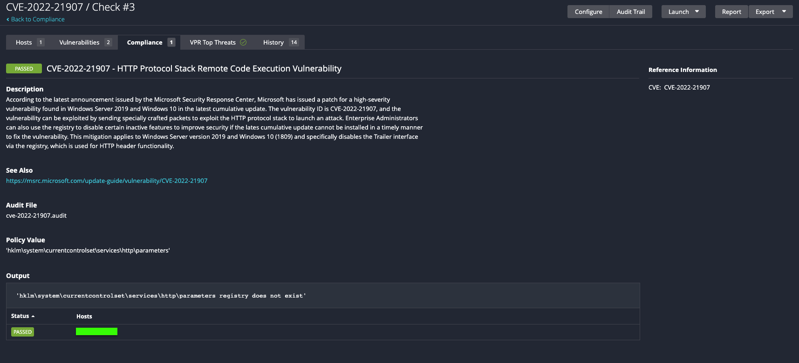
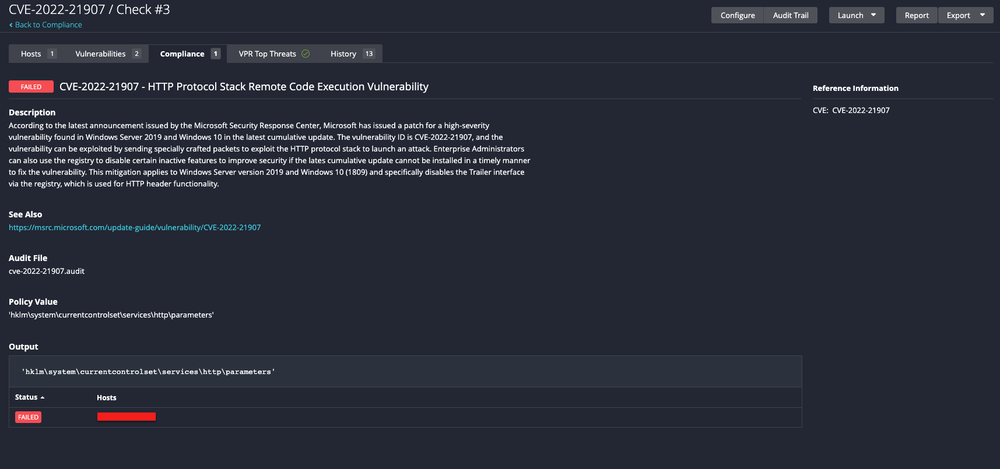

# CVE-2022-21907
According to the latest announcement issued by the Microsoft Security Response Center, Microsoft has issued a patch for a high-severity vulnerability found in Windows Server 2019 and Windows 10 in the latest cumulative update. The vulnerability ID is CVE-2022-21907, and the vulnerability can be exploited by sending specially crafted packets to exploit the HTTP protocol stack to launch an attack. Enterprise Administrators can also use the registry to disable certain inactive features to improve security if the lates cumulative update cannot be installed in a timely manner to fix the vulnerability. This mitigation applies to Windows Server version 2019 and Windows 10 (1809) and specifically disables the Trailer interface via the registry, which is used for HTTP header functionality.

Tenable audits can be used to check for the existence of this flaw.

## Audit information

Let's break down the audit and its output.

1. The Windows compliance plugin executes a series of REGISTRY_SETTING checks which evaluate for the existence of the specified platforms and reg_items and reports a PASSED result if the mitigations exists or FAILED result if the mitigations do not exist.

The following registry paths are checked for reg_item 'EnableTrailerSupport' and the value_data should be set to '0' or a null value.

```
    <custom_item>
      type        : REGISTRY_SETTING
      description : "CVE-2022-21907 - HTTP Protocol Stack Remote Code Execution Vulnerability"
      info        : "According to the latest announcement issued by the Microsoft Security Response Center, Microsoft has issued a patch for a high-severity vulnerability found in Windows Server 2019 and Windows 10 in the latest cumulative update. The vulnerability ID is CVE-2022-21907, and the vulnerability can be exploited by sending specially crafted packets to exploit the HTTP protocol stack to launch an attack. Enterprise Administrators can also use the registry to disable certain inactive features to improve security if the lates cumulative update cannot be installed in a timely manner to fix the vulnerability. This mitigation applies to Windows Server version 2019 and Windows 10 (1809) and specifically disables the Trailer interface via the registry, which is used for HTTP header functionality."
      reference   : "CVE|CVE-2022-21907"
      see_also    : "https://msrc.microsoft.com/update-guide/vulnerability/CVE-2022-21907"
      value_type  : POLICY_DWORD
      value_data  : 0
      reg_key     : "HKLM\System\Currentcontrolset\Services\Http\Parameters"
      reg_item    : "EnableTrailerSupport"
      reg_option  : CAN_BE_NULL
    </custom_item>
```

The audit will produce the following results when scanned against a passing target:


The audit will produce the following results when scanned against a failing target:


