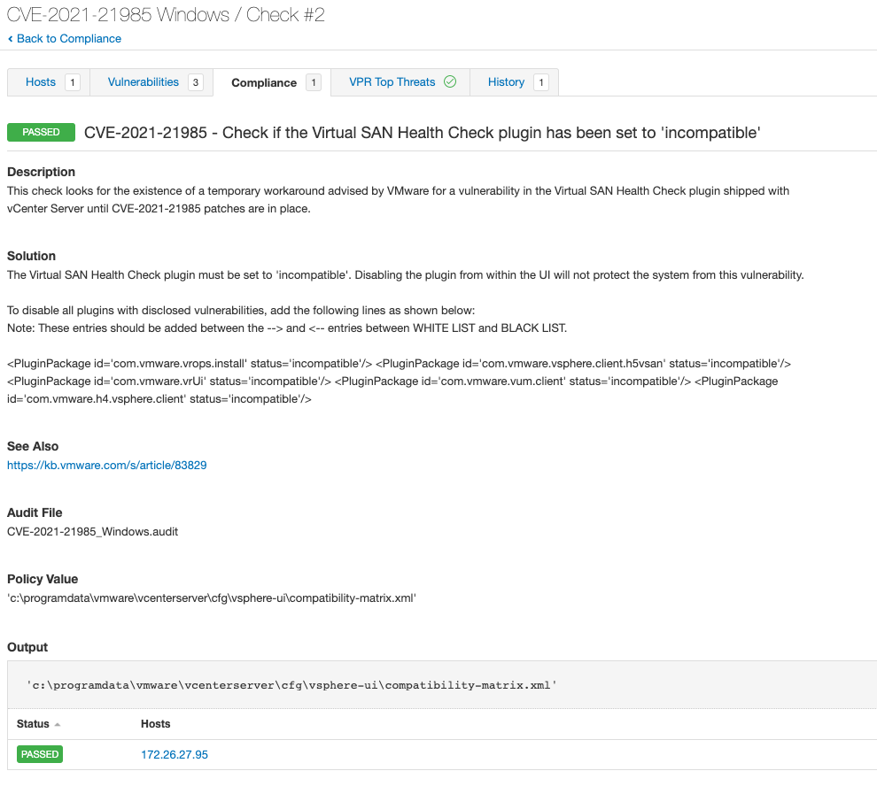

# CVE-2021-21985
Recently, VMware published an advisory (VMSA-2021-0010) regarding vulnerabilities impacting vCenter Server, [VMSA-2021-0010](https://www.vmware.com/security/advisories/VMSA-2021-0010.html). As part of a stopgap measure until systems can be patched, VMware has released recommended configuration settings to be applied to vulnerable targets.

Tenable audits can be used to check for the existence of the specific configuration settings.

## Audit information

## Windows
1. This conditional uses PowerShell to verify if a vulnerable version of VMware vCenter Server is installed.
```
<if>
  <condition type:"AND">
    <custom_item>
      type            : AUDIT_POWERSHELL
      description     : "Check for vulnerable vCenter version"
      powershell_args : "Get-WmiObject -Class Win32_Product | where name -eq 'VMware vCenter Server' | select Version | format-table -hidetableheaders"
      value_type      : POLICY_TEXT
      value_data      : "(6\.(5\.0\.([0-2][0-9]{4}|3[0-4][0-9]{3})|7\.0\.([1-3][0-9][0-9]{3}|4[0-7]{4}))|7\.0\.([01]\.[01]0[0123467]00|2\.00[01]00))"
      check_type      : CHECK_REGEX
    </custom_item>
  </condition>
```
2. If the conditional is true, execute the <then></then> block. The Windows compliance plugin reads the compatibility-matrix.xml file to ensure vulnerable plugins have been disabled (set to status incompatible).
```
<then>
  <custom_item>
    type        : FILE_CONTENT_CHECK
    description : "CVE-2021-21985 - Check if the Virtual SAN Health Check plugin has been set to 'incompatible'"
    info        : "This check looks for the existence of a temporary workaround advised by VMware for a vulnerability in the Virtual SAN Health Check plugin shipped with vCenter Server until CVE-2021-21985 patches are in place."
    solution    : "The Virtual SAN Health Check plugin must be set to 'incompatible' in C:\ProgramData\VMware\vCenterServer\cfg\vsphere-ui\compatibility-matrix.xml. Disabling the plugin from within the UI will not protect the system from this vulnerability.

To disable all plugins with disclosed vulnerabilities, add the following lines as shown below:
Note: These entries should be added between the --> and <-- entries between WHITE LIST and BLACK LIST.

<PluginPackage id=\"com.vmware.vrops.install\" status=\"incompatible\"/>
<PluginPackage id=\"com.vmware.vsphere.client.h5vsan\" status=\"incompatible\"/>
<PluginPackage id=\"com.vmware.vrUi\" status=\"incompatible\"/>
<PluginPackage id=\"com.vmware.vum.client\" status=\"incompatible\"/>
<PluginPackage id=\"com.vmware.h4.vsphere.client\" status=\"incompatible\"/>"
    see_also    : "https://kb.vmware.com/s/article/83829"
    value_type  : POLICY_TEXT
    value_data  : "C:\ProgramData\VMware\vCenterServer\cfg\vsphere-ui\compatibility-matrix.xml"
    regex       : 'com.vmware.vsphere.client.h5vsan'
    expect      : '<PluginPackage id="com.vmware.vsphere.client.h5vsan" status="incompatible"/>'
  </custom_item>
</then>
```
3. If the conditional is false, execute the <else></else> block. This will return a PASSED report stating that a vulnerable vCenter Server version/build was not detected. If it is desired to not have this report and return nothing, the entire <else></else> section can be deleted.
```
<else>
  <report type:"PASSED">
    description : "CVE-2021-21985 does not apply to this vCenter Server version/build."
    info        : "CVE-2021-21985 does not apply to this vCenter Server version/build."
    see_also    : "https://kb.vmware.com/s/article/83829"
  </report>
</else>
```

The full audit will produce the following results when scanned against targets:

